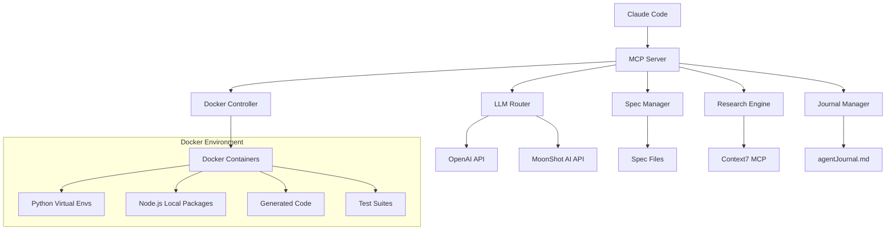
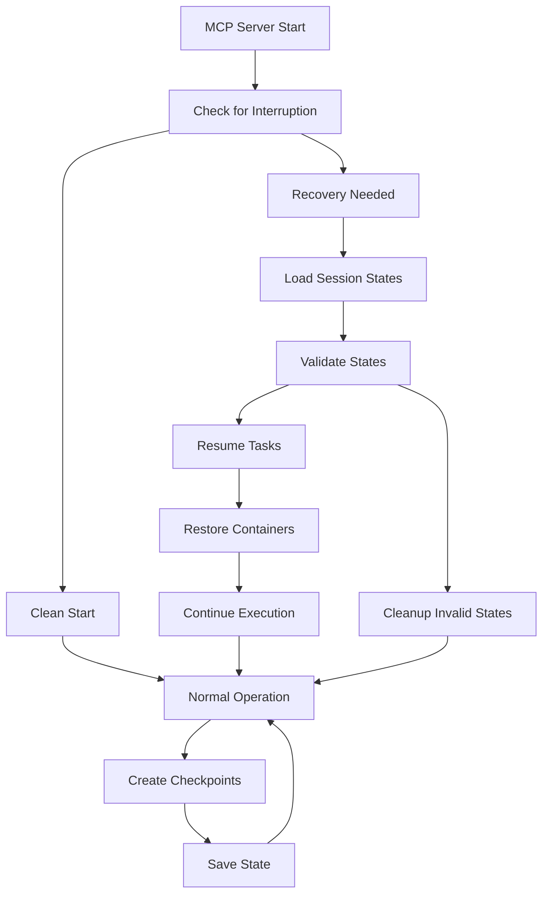

# Design Document

## Overview

The Claude Code MCP Server is a Python-based Model Context Protocol server that provides comprehensive coding assistance capabilities. It integrates with Claude Code to offer end-to-end development workflows including code generation, debugging, testing, research, and spec-driven development. The server operates within Docker containers for isolation and supports multiple LLM providers through their official APIs.

## Architecture

### High-Level Architecture



### Core Components

1. **MCP Server Core**: Main server implementing the Model Context Protocol
2. **LLM Router**: Manages communication with multiple LLM providers
3. **Docker Controller**: Manages isolated development environments
4. **Spec Manager**: Handles spec-driven development workflows
5. **Research Engine**: Integrates with external research capabilities
6. **Journal Manager**: Maintains comprehensive activity logs
7. **Code Generator**: Produces high-quality, documented code
8. **Test Runner**: Executes tests within Docker environments

## Components and Interfaces

### MCP Server Core

**Purpose**: Main entry point implementing the Model Context Protocol specification

**Key Classes**:
- `MCPServer`: Main server class handling MCP protocol
- `ToolRegistry`: Manages available tools and their registration
- `RequestHandler`: Processes incoming MCP requests

**Key Methods**:
```python
class MCPServer:
    async def handle_request(self, request: MCPRequest) -> MCPResponse
    async def list_tools(self) -> List[Tool]
    async def call_tool(self, name: str, arguments: dict) -> ToolResult
```

### LLM Router

**Purpose**: Abstracts LLM provider interactions and manages model selection

**Key Classes**:
- `LLMRouter`: Main routing logic
- `OpenAIProvider`: OpenAI API integration
- `MoonShotProvider`: MoonShot AI API integration
- `ModelConfig`: Configuration for LLM providers

**Key Methods**:
```python
class LLMRouter:
    async def generate_code(self, prompt: str, model_preference: str = None) -> str
    async def analyze_code(self, code: str, task: str) -> str
    async def get_available_models(self) -> List[str]
```

### Docker Controller

**Purpose**: Manages isolated development environments for code execution and testing

**Key Classes**:
- `DockerController`: Main Docker management
- `ContainerManager`: Individual container lifecycle
- `EnvironmentSetup`: Environment configuration

**Key Methods**:
```python
class DockerController:
    async def create_container(self, language: str, requirements: List[str]) -> Container
    async def execute_code(self, container_id: str, code: str) -> ExecutionResult
    async def run_tests(self, container_id: str, test_path: str) -> TestResult
```

### Spec Manager

**Purpose**: Handles spec-driven development workflows

**Key Classes**:
- `SpecManager`: Main spec management
- `RequirementsGenerator`: Creates requirements documents
- `DesignGenerator`: Creates design documents
- `TaskGenerator`: Creates task lists

**Key Methods**:
```python
class SpecManager:
    async def create_spec(self, feature_idea: str) -> SpecDocument
    async def update_spec(self, spec_id: str, feedback: str) -> SpecDocument
    async def get_feedback(self, spec: SpecDocument) -> str
```

### Research Engine

**Purpose**: Provides research capabilities for documentation, best practices, and troubleshooting

**Key Classes**:
- `ResearchEngine`: Main research coordinator
- `Context7Integration`: Integration with Context7 MCP
- `WebSearcher`: Internet search capabilities

**Key Methods**:
```python
class ResearchEngine:
    async def research_documentation(self, technology: str, query: str) -> str
    async def find_best_practices(self, language: str, task: str) -> List[str]
    async def search_solutions(self, error: str, context: str) -> List[str]
```

### State Management & Recovery System

**Purpose**: Ensures resilience against interruptions and enables seamless recovery

**Key Classes**:
- `StateManager`: Manages persistent state across sessions
- `RecoveryEngine`: Handles interruption recovery
- `CheckpointManager`: Creates recovery checkpoints
- `SessionTracker`: Tracks active sessions and progress

**Key Methods**:
```python
class StateManager:
    async def save_session_state(self, session_id: str, state: dict) -> None
    async def load_session_state(self, session_id: str) -> Optional[dict]
    async def create_checkpoint(self, task_id: str, progress: dict) -> str
    async def restore_from_checkpoint(self, checkpoint_id: str) -> dict

class RecoveryEngine:
    async def detect_interruption(self) -> bool
    async def recover_active_sessions(self) -> List[str]
    async def resume_task(self, task_id: str) -> bool
    async def cleanup_stale_sessions(self) -> None
```

## Data Models

### Core Data Structures

```python
from dataclasses import dataclass
from typing import List, Optional, Dict, Any
from enum import Enum

class LLMProvider(Enum):
    OPENAI = "openai"
    MOONSHOT = "moonshot"

class TaskStatus(Enum):
    PENDING = "pending"
    IN_PROGRESS = "in_progress"
    COMPLETED = "completed"
    FAILED = "failed"

@dataclass
class ModelConfig:
    provider: LLMProvider
    api_key: str
    model_name: str
    base_url: Optional[str] = None

@dataclass
class CodeTask:
    id: str
    description: str
    language: str
    requirements: List[str]
    status: TaskStatus
    container_id: Optional[str] = None
    result: Optional[str] = None

@dataclass
class SpecDocument:
    id: str
    title: str
    requirements: str
    design: str
    tasks: List[str]
    status: str
    created_at: str
    updated_at: str

@dataclass
class JournalEntry:
    timestamp: str
    action: str
    details: str
    result: str
    error: Optional[str] = None

@dataclass
class SessionState:
    session_id: str
    task_id: str
    current_step: str
    progress: Dict[str, Any]
    container_state: Optional[Dict[str, Any]]
    llm_context: List[str]
    created_at: str
    last_updated: str

@dataclass
class Checkpoint:
    checkpoint_id: str
    task_id: str
    step_name: str
    state_data: Dict[str, Any]
    timestamp: str
    recoverable: bool
```

### Configuration Schema

```python
@dataclass
class ServerConfig:
    llm_providers: List[ModelConfig]
    docker_settings: Dict[str, Any]
    research_settings: Dict[str, Any]
    journal_path: str
    spec_directory: str
    default_model: str
```

## Error Handling

### Error Categories

1. **LLM API Errors**: Rate limits, authentication, model unavailability
2. **Docker Errors**: Container creation, execution failures, resource limits
3. **Spec Management Errors**: File I/O, validation, format errors
4. **Research Errors**: Network issues, API unavailability
5. **Code Execution Errors**: Syntax errors, runtime exceptions, test failures

### Error Handling Strategy

```python
class MCPServerError(Exception):
    """Base exception for MCP server errors"""
    pass

class LLMProviderError(MCPServerError):
    """Errors related to LLM provider communication"""
    pass

class DockerExecutionError(MCPServerError):
    """Errors related to Docker container execution"""
    pass

class SpecValidationError(MCPServerError):
    """Errors related to spec document validation"""
    pass

# Error handling with retry logic and fallbacks
async def with_retry_and_fallback(
    primary_func: Callable,
    fallback_func: Optional[Callable] = None,
    max_retries: int = 3
) -> Any:
    """Execute function with retry logic and optional fallback"""
    pass
```

## Testing Strategy

### Unit Testing

- **Component Testing**: Each core component tested in isolation
- **Mock Dependencies**: External APIs and Docker operations mocked
- **Test Coverage**: Minimum 90% code coverage required

### Integration Testing

- **API Integration**: Test actual LLM provider integrations
- **Docker Integration**: Test container creation and code execution
- **MCP Protocol**: Test MCP server protocol compliance

### End-to-End Testing

- **Workflow Testing**: Complete spec-driven development workflows
- **Multi-Model Testing**: Test switching between LLM providers
- **Error Scenarios**: Test error handling and recovery

### Test Structure

```python
# Unit tests
tests/
├── unit/
│   ├── test_llm_router.py
│   ├── test_docker_controller.py
│   ├── test_spec_manager.py
│   └── test_research_engine.py
├── integration/
│   ├── test_api_integration.py
│   ├── test_docker_integration.py
│   └── test_mcp_protocol.py
└── e2e/
    ├── test_complete_workflow.py
    └── test_error_scenarios.py
```

## Security Considerations

### API Key Management

- Environment variable storage for API keys
- Secure key rotation capabilities
- No hardcoded credentials in source code

### Docker Security

- Non-root user execution within containers
- Resource limits to prevent abuse
- Network isolation for containers
- Regular base image updates

### Code Execution Safety

- Sandboxed execution environments
- Input validation and sanitization
- Timeout mechanisms for long-running operations
- Audit logging for all code execution

## Performance Considerations

### Caching Strategy

- LLM response caching for repeated queries
- Docker image caching for faster container startup
- Spec document caching for quick access

### Resource Management

- Container resource limits (CPU, memory)
- Connection pooling for API requests
- Async/await for non-blocking operations
- Graceful degradation under load

## Deployment and Configuration

### Package Structure

```
claude-code-mcp-server/
├── src/
│   ├── mcp_server/
│   │   ├── __init__.py
│   │   ├── server.py
│   │   ├── llm/
│   │   ├── docker/
│   │   ├── specs/
│   │   ├── research/
│   │   ├── journal/
│   │   └── state/
│   └── config/
├── tests/
├── docker/
├── state/
│   ├── sessions/
│   ├── checkpoints/
│   └── recovery/
├── docs/
│   ├── masterGuide.md
│   ├── agentJournal.md
│   ├── stateRecovery.md
│   └── fileStructure.md
├── requirements.txt
├── setup.py
└── README.md
```

### State Management Files

**masterGuide.md**: Central documentation explaining all files and their purposes
- File structure explanation
- Recovery procedures
- Troubleshooting guide
- Usage instructions

**agentJournal.md**: Comprehensive activity log
- All actions performed by the MCP server
- Timestamps and context for each action
- Error logs and resolution attempts
- Progress tracking for ongoing tasks

**stateRecovery.md**: Recovery state information
- Last known good state
- Active sessions and their progress
- Checkpoint references
- Recovery instructions

**Session State Files** (in `state/sessions/`):
- `session_{id}.json`: Individual session state
- `active_sessions.json`: List of currently active sessions
- `session_metadata.json`: Session metadata and history

**Checkpoint Files** (in `state/checkpoints/`):
- `checkpoint_{id}.json`: Individual checkpoint data
- `checkpoint_index.json`: Checkpoint registry and metadata

### Configuration Management

- YAML/JSON configuration files
- Environment variable overrides
- Runtime configuration validation
- Hot-reload capabilities for development

## Resilience and Recovery Design

### Recovery Workflow



### State Persistence Strategy

1. **Continuous State Saving**: Save state after each significant operation
2. **Checkpoint Creation**: Create recovery checkpoints at key milestones
3. **Session Tracking**: Track all active sessions and their progress
4. **Container State**: Preserve Docker container states and configurations
5. **Context Preservation**: Maintain LLM conversation context across interruptions

### Recovery Mechanisms

**Automatic Recovery**:
- Detect incomplete sessions on startup
- Restore Docker containers to previous state
- Resume tasks from last checkpoint
- Rebuild LLM context from journal

**Manual Recovery**:
- Recovery commands for specific sessions
- State inspection and debugging tools
- Manual checkpoint restoration
- Session cleanup utilities

### File-Based State Management

**Session Files**: JSON files containing complete session state
**Checkpoint Files**: Incremental state snapshots for quick recovery
**Journal Integration**: Cross-reference journal entries with state changes
**Metadata Tracking**: Track file relationships and dependencies